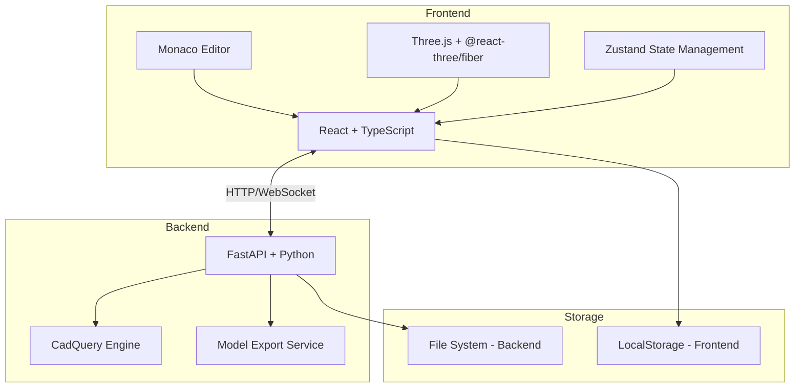
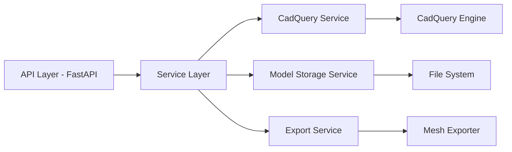
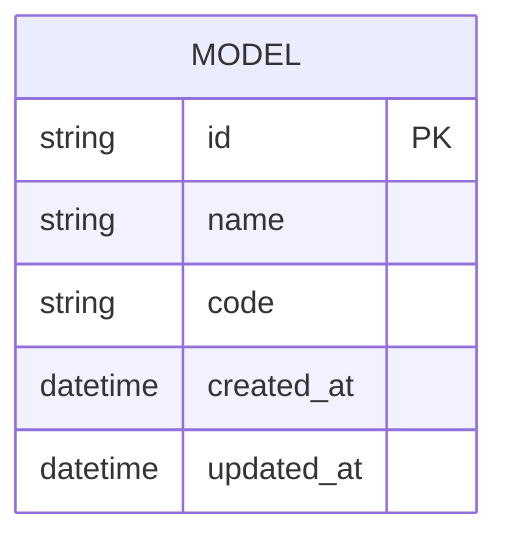

## 1. Architecture Design



## 2. Technology Description
- **Frontend**: React@18 + TypeScript + Vite + Tailwind CSS + Zustand
- **Code Editor**: Monaco Editor (@monaco-editor/react)
- **3D Rendering**: Three.js + @react-three/fiber + @react-three/drei
- **Backend**: FastAPI@0.136 + Uvicorn@0.46 + Python@3.13
- **CAD Engine**: CadQuery@2.7.0
- **Initialization Tool**: vite-init
- **State Management**: Zustand

## 3. Route Definitions
| Route | Purpose |
|-------|---------|
| / | 模型管理页面 |
| /editor/:id | 代码编辑器页面 |
| /templates | 代码模板页面 |

## 4. API Definitions
### 4.1 TypeScript Types
```typescript
interface Model {
  id: string;
  name: string;
  code: string;
  createdAt: string;
  updatedAt: string;
  thumbnail?: string;
}

interface ExecuteRequest {
  code: string;
}

interface ExecuteResponse {
  success: boolean;
  meshData?: string;  // Base64 encoded STL
  error?: string;
}

interface ExportRequest {
  code: string;
  format: 'stl' | 'step';
}

interface ExportResponse {
  success: boolean;
  fileData?: string;  // Base64 encoded
  filename?: string;
  error?: string;
}
```

### 4.2 FastAPI Endpoints
```python
# POST /api/execute
# 执行 CadQuery 代码并返回 3D 模型数据

# POST /api/export
# 导出模型为指定格式

# GET /api/models
# 获取所有模型列表

# POST /api/models
# 创建新模型

# PUT /api/models/{id}
# 更新模型

# DELETE /api/models/{id}
# 删除模型
```

## 5. Server Architecture Diagram



## 6. Data Model
### 6.1 Data Model Definition


### 6.2 File Storage Structure
```
data/
└── models/
    ├── {id}/
    │   ├── code.py
    │   ├── metadata.json
    │   └── thumbnail.png (optional)
    └── ...
```
