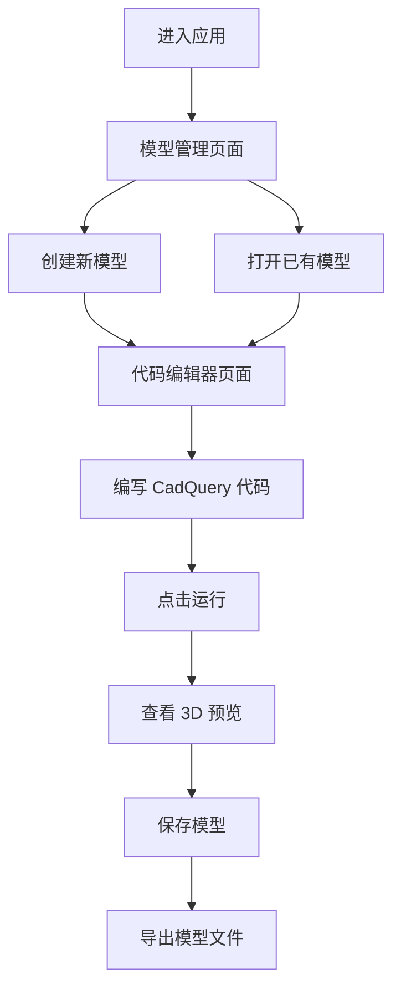

## 1. Product Overview
CadQuery 在线建模平台，提供 Web 界面进行 3D 模型的代码编写、实时预览、管理和导出。
- 为工程师和设计师提供在线的 CadQuery 代码编辑环境，无需本地安装 Python 和 CadQuery
- 实现模型的在线管理、版本控制和协作分享

## 2. Core Features

### 2.1 Feature Module
1. **代码编辑器页面**: CadQuery 代码编辑、语法高亮、实时运行
2. **3D 预览页面**: 模型的 3D 可视化、旋转、缩放、平移
3. **模型管理页面**: 模型列表、创建、删除、重命名、导出
4. **代码模板页面**: 常用 CadQuery 代码模板库

### 2.3 Page Details
| Page Name | Module Name | Feature description |
|-----------|-------------|---------------------|
| 代码编辑器 | 代码编辑区 | Monaco 编辑器，语法高亮，代码补全 |
| 代码编辑器 | 3D 预览区 | Three.js 渲染模型，实时更新 |
| 代码编辑器 | 控制按钮 | 运行、保存、导出按钮 |
| 模型管理 | 模型列表 | 显示所有模型，支持搜索和筛选 |
| 模型管理 | 操作区 | 创建、删除、重命名、复制、导出模型 |
| 代码模板 | 模板库 | 分类展示常用代码模板，支持快速插入 |

## 3. Core Process
用户进入应用后，可以：
1. 创建新模型或打开已有模型
2. 在代码编辑器中编写 CadQuery 代码
3. 点击运行按钮查看 3D 预览
4. 保存模型到本地存储
5. 导出模型为 STL 或 STEP 格式

## 4. User Interface Design
### 4.1 Design Style
- **主色调**: 深蓝色 (#1e3a8a) 与深灰色 (#1f2937) 搭配
- **辅助色**: 青色 (#06b6d4) 和橙色 (#f59e0b)
- **按钮风格**: 圆角按钮，有 hover 和 active 状态
- **字体**: JetBrains Mono（代码）, Inter（界面文字）
- **布局风格**: 分栏布局，左侧编辑器，右侧预览
- **图标**: Lucide React 图标库

### 4.2 Page Design Overview
| Page Name | Module Name | UI Elements |
|-----------|-------------|-------------|
| 代码编辑器 | 整体布局 | 左右分栏，左侧 60% 编辑器，右侧 40% 预览区 |
| 代码编辑器 | 顶部工具栏 | 面包屑导航，运行、保存、导出按钮 |
| 3D 预览区 | 画布 | 黑色背景，带坐标轴参考线 |
| 模型管理 | 列表卡片 | 卡片式布局，显示模型缩略图和元数据 |
| 代码模板 | 网格布局 | 分类标签，模板卡片网格展示 |

### 4.3 Responsiveness
- Desktop-first 设计
- 移动端适配为上下布局（编辑器在上，预览在下）
- 触控优化的 3D 预览控制

### 4.4 3D Scene Guidance
- **环境**: 深色背景，带柔和环境光
- **光照**: 三点光照系统（主光、补光、背光）
- **相机**: 轨道控制器，支持透视和正交视图切换
- **交互**: 鼠标拖拽旋转，滚轮缩放，右键平移
- **后处理**: 抗锯齿，轻微阴影
